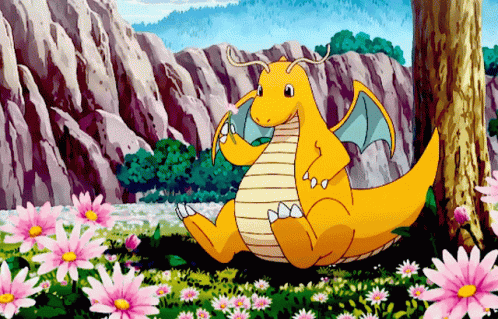

# Sintaxis y Semántica de los Lenguajes
### Miércoles a la noche, CL 2022. Comisión K2051.
* **Alumno:** Lautaro Rodrigo Ocampo.
* **Legajo:** 1733448.

Este repositorio tiene como objetivo reunir los trabajos individuales de la asignatura.

